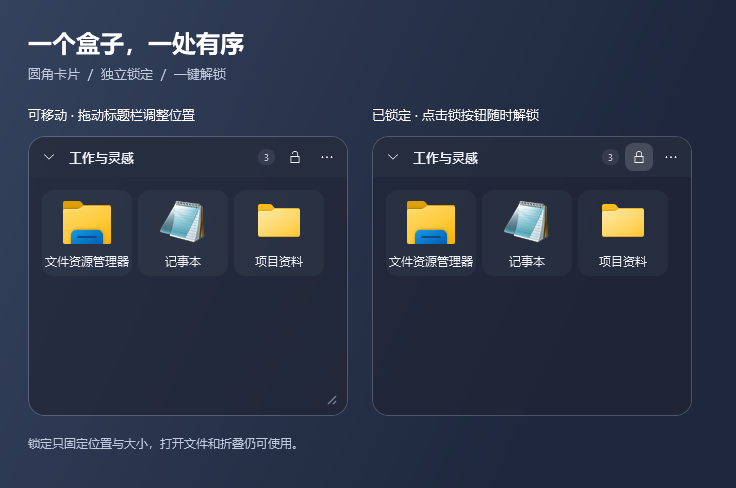
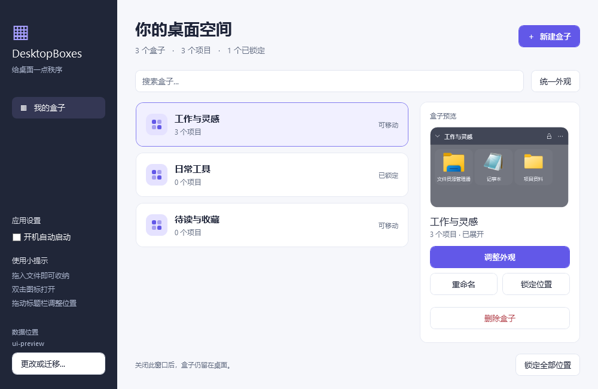
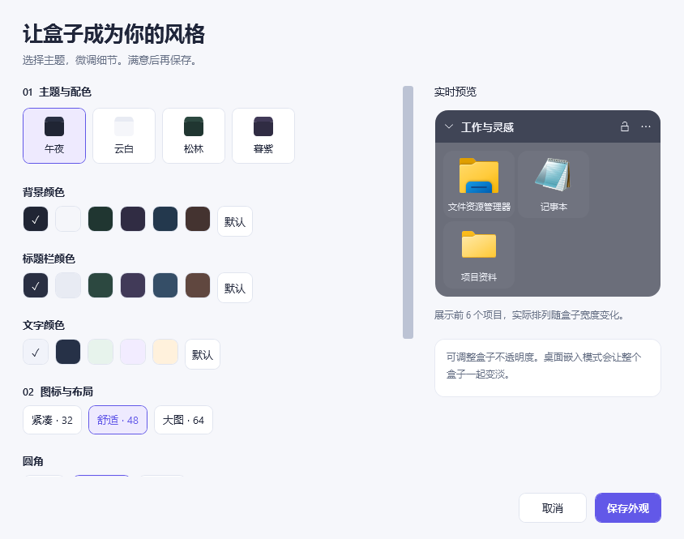

# 桌面盒子（DesktopBoxes）

一个 Windows 桌面整理工具：把应用、快捷方式、文件夹、文件拖进「盒子」，盒子贴桌面、可折叠成标题栏。

支持 Windows 10 / 11 x64。当前版本处于早期可用阶段，欢迎通过 Issue 反馈不同 Windows 版本、多显示器和混合 DPI 场景的问题。

## 功能

- 保留 Windows 系统桌面图标；盒子挂接到 WorkerW/Progman 桌面层，位于桌面图标之上、普通窗口之下，`Win+D` 后仍在
- 新建 / 删除 / 重命名盒子；拖动移动、拖右下角缩放
- 所有盒子使用圆角边框（含 WorkerW 桌面模式），可选小 / 标准 / 大圆角；旧直角配置自动按圆角显示
- 标题栏常驻独立锁按钮：点击锁定 / 再次点击解锁，固定当前盒子的位置和大小；折叠、打开文件不受影响，锁定状态自动保存
- 双向移动 `.exe` / `.lnk` / 文件夹 / 文件：拖入后移入盒子专用目录，原位置不再显示；拖回桌面或资源管理器后从盒子移除；双击启动 / 打开
- 折叠成标题栏（带 160ms 动画）；图标项右键：打开 / 打开所在位置 / 重命名 / 移回桌面
- 换肤：新盒子默认 65% 不透明；可调整透明度、主题预设、背景色、标题栏色、文字色、背景图片（适应·拉伸·平铺·居中）和图标大小（小·中·大）
- 托盘常驻、总控内开机自启和数据位置设置、单实例
- 位置 / 大小 / 折叠 / 锁定 / 内容 / 外观持久化到 JSON，并采用原子保存、上一版备份和损坏配置恢复

## 界面

新版总控使用浅色面板与蓝紫色强调色，支持搜索盒子、预览内容、快速重命名、锁定位置和统一外观。桌面盒子默认使用深色主题，也可以在外观编辑器里切换主题并实时预览。

桌面盒子使用圆角卡片、轻量图标底板与项目数量徽标。右上角的锁按钮始终可见，锁定时显示实心底色；折叠后仍可直接解锁。为保证标题和操作按钮可用，盒子的最小宽度为 220。







截图使用演示数据，展示的是 1.2.1 界面。

## 运行

- 推荐：从仓库的 **Releases** 页面下载最新的单文件 EXE 或便携 ZIP
- 便携版：解压带 `portable` 标记文件的便携包，双击 `DesktopBoxes.App.exe`
- 源码运行：`dotnet run --project src\DesktopBoxes.App`

启动后桌面左上角出现「我的盒子」，右上角托盘有图标（右键菜单）。

## 数据位置

默认 `%AppData%\DesktopBoxes\`（`boxes.json`、`boxes.json.bak`、`items\`、`transfers\`、`desktop-exports.json`、`backgrounds\`、`startup.log`、`error.log`）。

- 便携模式：在 exe 同目录放一个空文件 `portable`，数据存到 exe 旁 `data\`
- 自定义目录：在默认位置的 `storage.location` 文件里写目标目录绝对路径
- 也可以在总控侧栏选择“更改或迁移…”；程序会复制托管文件及背景资源、更新文件路径、切换保存位置，并保留原目录供手动确认后清理；目标不能已有 `items\`，未完成的移动需先处理。托盘菜单不再提供这一设置入口

## 文件移动与安全

- **拖入现在会移动真实文件，而不是添加引用。** 快捷方式只移动 `.lnk` 本身，指向的程序不动；普通文件、独立 EXE 和文件夹会改变实际路径。请不要把依赖安装目录的程序本体当作快捷方式拖入。
- 文件保存在 `items/<盒子ID>/<移动ID>/<原文件名>`，同名项目分别存放，不互相覆盖。不要清理或删除 `items`，其中是你的实际文件，不是缓存。
- 拖到桌面 / 资源管理器使用 Windows 的移动流程；只有确认源文件已离开后才移除盒子图标。取消拖动、无效落点或仅复制不会移除源项目。盒子只接受移动，不把 Ctrl 复制静默转换成移动。
- 盒子之间也可移动；拖回自身不重复添加。右键“移回桌面”和删除盒子时，同名项目自动改为 `名称 (2)` 等。删除盒子会先把托管文件移回桌面；失败时保留盒子及未完成项目。
- 使用同步配置保存和 `transfers` 移动记录；重启时恢复未提交的配置，并扫描托管目录找回遗漏项目。跨盘文件夹移动中途取消可能已有部分内容到达目标，两处都会保留并提示检查，不自动删除或强行回滚。
- 程序正常退出或捕获到致命异常时，会把每个盒子的内容额外复制到桌面的同名文件夹。下次启动时，仅自动删除带有匹配安全标记且内容未变化的副本；用户修改、新增或替换的内容会留在桌面。已有的无标记同名文件夹不会被接管，托管原件也不会移动。强制结束进程、系统断电等无法执行退出回调的情况不在此保证范围内。
- 旧版已有项目保持外部引用，不会在升级时批量移动。可重新从桌面拖入进行收纳；旧引用仍可选择“仅移除旧版引用（保留原文件）”。
- “此电脑”“回收站”等虚拟图标、系统目录、符号链接 / 目录联接及含云占位文件的目录暂不接受移动。请先把云文件完整下载到本地。

## 构建

```powershell
# 依赖：.NET 8 SDK（含 WindowsDesktop）
dotnet restore DesktopBoxes.sln --locked-mode
dotnet format DesktopBoxes.sln --no-restore --verify-no-changes
dotnet build DesktopBoxes.sln -c Release --no-restore
dotnet test DesktopBoxes.sln -c Release --no-build --no-restore

# 同时生成安装器输入目录与带 portable 标记的便携包
.\build-release.ps1 -Version 1.2.1
```

`artifacts\installer\` 中生成一个自包含的 `DesktopBoxes.App.exe`，可用作 Inno Setup 输入；`artifacts\DesktopBoxes-portable-win-x64-<版本>.zip` 是带便携模式标记的压缩包。旧版本的独立 EXE / ZIP 不会自动更新。构建脚本会拒绝清理含 `data\` 的输出目录，避免误删便携模式的真实用户文件。

## 项目结构

```
src/DesktopBoxes.Core/    数据模型、JSON 持久化、数据目录、启动器
src/DesktopBoxes.Win32/   贴桌面(WorkerW/Progman)、Shell 图标、.lnk 解析
src/DesktopBoxes.UI/      盒子窗口(HwndSource)、图标缓存、外观/重命名对话框
src/DesktopBoxes.App/     入口、托盘、单实例、开机自启、异常日志
tests/DesktopBoxes.Tests/ xunit 单元测试
```

技术栈：.NET 8 + WPF（+ WinForms NotifyIcon）+ Vanara.PInvoke/Windows.Shell。

## 已知限制

- 桌面模式以 WorkerW/Progman 作为窗口所有者并使用逐像素透明；默认不透明度为 65%，圆角通过 WPF 与原生窗口区域共同裁剪。已有配置会保留用户原先保存的不透明度。
- 单文件自包含 exe 约 150MB（含 .NET 运行时 + WPF 原生库，WPF 不支持裁剪）。
- 已启用 Per-Monitor V2 DPI 并处理基础坐标换算；混合缩放多显示器仍需真机回归。
- 外观目前按「每盒独立」存储；总控中的“统一设置”会把当前外观复制到全部盒子。

## 参与贡献

提交 Issue 或 Pull Request 前请阅读 [CONTRIBUTING.md](CONTRIBUTING.md) 和 [CODE_OF_CONDUCT.md](CODE_OF_CONDUCT.md)。安全漏洞请按照 [SECURITY.md](SECURITY.md) 私密报告。版本变化记录在 [CHANGELOG.md](CHANGELOG.md)。

## License

本项目采用 [MIT License](LICENSE)。
